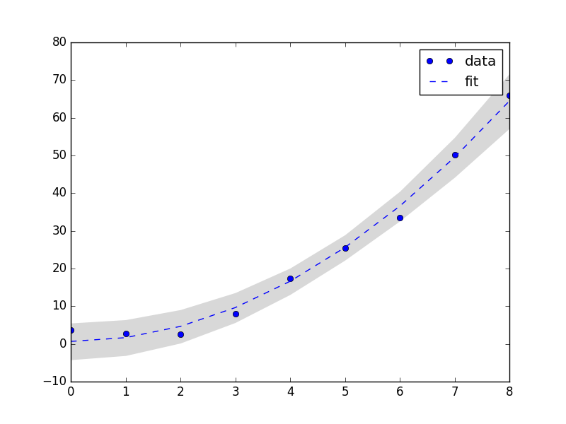

# Curve Fit Utils

`curve_fit_utils` is a Python module containing some simple but useful tools for curve fitting and regression.

### Description
The aim is to provide a readable and reusable code made from scratch and based on Numpy and Scipy modules. The module is essentially a collection of routines that I use often during my work, so I simply decided to organize the code and make it reusable. The idea is to take care of portability (often I need to use and call these routines quickly on different environments or devices), readability and adaptability to other Python codes. At present, this module contains

* `confidence_band`: computes confidence (or prediction) bands of a fit model. It works both in the case of Ordinary Least Square (OLS) or Non-Linear Least Square (NLLS) and allows to handle known variances (e.g. measurements with errors) or unknown variance (with homoscedastaticity assumption). The standard construction method, robust with OLS, is also applied to NLLS regression by jacobian approximation. Alternatively, bootstrap technique can be used to obtain approximate confidence bands. The function is a sort of wrapper of [scipy.optimize.curve_fit](https://docs.scipy.org/doc/scipy/reference/generated/scipy.optimize.curve_fit.html) and users (like me) which are friendly with it will found this routine very easy to use.

* `chi2_gof_test`: a function that implements the Chi-Square goodness-of-fit test. For a given set of data and a model to be tested, it just computes the the Sum of Square Errors (SSE), or Sum of Square Residuals (SSR), and test the hyphotesis that it is distributed as a Chi-Square variable, returning the Mean Square Error (MSE) and/or the p-value.

A somehow more detailed description of the module `curve_fit_utils` and its routines, about both the implementation and the statistical parts, can be found in the [notes](NOTES.md) file. I highly recommend to read the description of the different functions, especially the statistical stuff in order to know what the functions are doing with the data. For a first quick use it is also possible to look directly at the [module](curve_fit_utils.py) itself where a description of the arguments needed, returns and options is reported in the definition of each routine.

### Usage
Here are reported some lines of code that explains, through a couple of examples, how to use the module. Other examples (some of them used as tests after coding) can be found in the directory [playground](playground/). 

For starters, just copy the module `curve_fit_utils` in the working directory and import it or some of the function(s) you need
```python
# import curve_fit_utils # or
from curve_fit_utils import confidence_band, chi2_gof_test
```
Lets go straight into the example. Suppose to have some data and a model we want to fit
```python
def model (x, *p):
    return p[0]+p[1]*x**2
    #or also NL models such as p[0]*np.exp(-p[1]*x)/x and so on
```
if we are interest in constructing a confidence band around the fit curve, we obtain it by using the function `confidence_band` with the desired (say 95%) CL
```python
# xdata and ydata are the independent and dependent variable arrays
upper, lower = confidence_band(model, xdata, ydata, confidence_level=0.95)
```
where `up` and `low` are Numpy arrays containing the bounds of the band. If needed one can use this routine as a sort of wrapper of [scipy.optimize.curve_fit](https://docs.scipy.org/doc/scipy/reference/generated/scipy.optimize.curve_fit.html) and get the full output
```python
upper, lower, f, popt, pcov = confidence_band(model, xdata, ydata, p0=[1.,1.], confidence_level=.95, full_output=True)
```
obtaining also the fit curve `f` of the mean predicted response (just the optimized model), the optimized values of the parameters `popt` and the estimated covariance matrix `pcov` of them, exactly as `curve_fit` does. Finally we can plot all the results (here I use [matplotlib.pyplot](https://matplotlib.org/api/pyplot_api.html))
```python
from matplotlib import pyplot as plt
plt.plot(xdata, ydata, 'bo', label='data')
plt.plot(xdata, f, 'r--', label='fit')
plt.fill_between(xdata, lower, upper, facecolor='gray', alpha='0.3') 
plt.legend()
plt.show()
```
so that the confidence band is plotted in trasparency together with the fit curve and the data. Something like that 


Now we change our mind and make new requests: we want to define prediction bands instead of confidence bands, to define them on a different range and to use bootstrap method in the computation. Then
```python 
x = np.linspace(min(xdata), max(xdata) #create a more dense range of points
upper_pred, lower_pred = confidence_band(model, xdata, ydata, 
                                         xvals=x, predition=True, bootstrap=True)
```
and now the bounds can be plotted against the new range `x` defined above. Finally, let's suppose now to be in the known variance case, i.e. our data are measures affected by an error. We have to tell it to the routine by passing the correct keyword arguments which are the same used in Scipy in `curve_fit`
```python
#yerrs is the array with the errors of ydata
upper, lower = confidence_band(model, xdata, ydata, sigma=yerrs, absolute_sigma=True, bootstrap=True)
```
which will give us confidence bands (approximate by bootstrap) when variances are known (and they are not only weights). In this case the CL is 68% by default.. Finally, we want also to test the model, i.e. we ask if it is statistically acceptable to describe our data. To do so we use the `chi2_gof_test` function
```python
from curve_fit_utils import chis2_gof_test
#suppose optimized parameter array 'popt' is given by previous computation
MSE, SSE, ndof, pvalue = chi2_gof_test(model, xdata, ydata, popt, 
                                       sigma=yerrs, full_output=True
```
then we can look at the Mean Square Error `MSE` which is defined as the Sum of Square Errors `SSE` divided by the degrees of freedom `ndof`. If we believe our data to be normally distributed, then SSE would be distributed as ChiSquare variable (in the same way, MSE as a reduced ChiSquare) and our hypothesis about the model can be checked by looking at the value of `pvalue` which is the p-value.

### License
See the file [License.txt](LICENSE.txt).

### Author
Andrea Rucci, Department of Physics of University of Pisa and INFN Pisa

### Todos
- ~~Add bootstrap technique to obtain approximate confidence bands in `confidence_band` routine~~
- ~~Indicates some statistical references to the [notes](NOTES.md)~~
- ~~Modify `chi2_gof_test` to handle with frequency/counts~~
- Handle with bounds in `curve_fit` called in costructing confidence bands
- Create examples comparing confidence bands with bootstrap technique

##### Last update 21/12/2017


